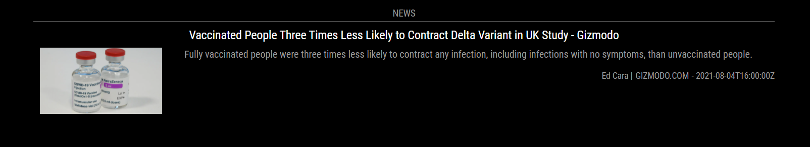

# MMM-NewsAPI


A [MagicMirror²](https://magicmirror.builders) module to to get news from [NewsAPi.org](https://newsapi.org/).

[](LICENSE)

## Support
If you like my module you can support my work by giving me a star ir buy me a coffee.

<a href="https://www.buymeacoffee.com/mumblebaj" target="_blank"></a>

 

## Updates
- Make sortBy an optional parameter for both `headlines` and `everything`
- Add DEBUG Handling.
- - Only add `debug: true` to the config section if you are experiencing issues and require more information to find issues.
- Replaced moment with luxon
- Replaced request with node-fetch
- Remove the following line from your config `className: "NEWS",`. It is no longer required and module will stop working if not removed.
- Optional QR code via QRious

## Dependencies
- luxon@2.0.2
- node-fetch@2.6.1

## Installation

In your terminal, go to your MagicMirror's Module folder:
````
cd ~/MagicMirror/modules
````

Clone this repository:
````
git clone https://github.com/mumblebaj/MMM-NewsAPI.git
````

Add the module to the modules array in the `config/config.js` file:
````javascript
  {
			module: "MMM-NewsAPI",
			header: "NEWS",
			position: "bottom_bar",
  },
````

## Configuration options

The following properties can be configured:


| Option                       | Description
| ---------------------------- | -----------
| `header`                     | The header text <br><br> **Default value:** `'NEWS'`
| `choice`                     | Type of query to be instantiated <br><br> **Possible values:** `headlines` or `everything` <br> **Default value:** `headlines`
| `type`                       | Orientation <br><br> **Possible values:** `horizontal` or `vertical` <br> **Default value:** `horizontal`. Module does currently not cater for vertical
| `pageSize`                   | The number of articles to be returned. Max = 100 <br> **Default value:** `20`
| `sortBy`                     | The order to sort the articles in. <br> **Possible values:** `relevancy`, `popularity`, `publishedAt` <br> only available for `choice: "everything"`
| `drawInterval`               | The amount of time each article is displayed <br> **Default value:** `30 seconds`
| `templateFile`               | The template file to use. You can create your own template file and reference here. For now use `template.html`
| `fetchInterval`              | The time interval between fetching new articles. There is a daily limit of 100 calls per apiKey. Best to set this to 100*60*60 
| `apiKey`                     | You can obtain an API Key from [NewsAPi.org](https://newsapi.org/)
| `QRCode`                     | Boolean true/false value to display QR code for article URL. Default is false.

## Query Options

**The following query options can be defined** <br>
When specifying the query options take note of the following: <br>
When using `headlines`, `country` and `sources` cannot be used together. <br>The `domains` option cannot be used on it's own, you have to specify any of the following parameters with it: `sources`, `q`, `language`, `country`, `category`. <br>When using `everything`, you cannot use the `country` option. <br>To try more combinations you can visit [NewsAPi.org](https://newsapi.org/) 

| Option                       | Description
| ---------------------------- | -----------
| `country`                    | The 2-letter ISO 3166-1 code of the country you want to get headlines for. <br>Possible options: <br> `ae` `ar` `at` `au` `be` `bg` `br` `ca` `ch` `cn` <br> `co` `cu` `cz` `de` `eg` `fr` `gb` `gr` `hk` `hu` `id` `ie` `ve` `za` <br> `il` `in` `it` `jp` `kr` `lt` `lv` `ma` `mx` `my` `ng` `nl` <br> `no` `nz` `ph` `pl` `pt` `ro` `rs` `ru` `sa` `se` `sg` `si` <br> `sk` `th` `tr` `tw` `ua` `us`. <br> **Note: you can't mix this param with the sources param**
| `category`                   | The category you want to get headlines for. <br> Possible options: `business` `entertainment` `general` `health` `science` `sports` `technology`. <br> **Note: you can't mix this param with the sources param.**
| `q`                          | Keywords or phrases to search for in the article title and body
| `qInTitle`                   | Keywords or phrases to search for in the article title only
| `sources`                    | A comma-seperated string of identifiers (maximum 20) for the news sources or blogs you want headlines from 
| `domains`                    | A comma-seperated string of domains (eg bbc.co.uk, techcrunch.com, engadget.com) to restrict the search to.
| `excludeDomains`             | A comma-seperated string of domains (eg bbc.co.uk, techcrunch.com, engadget.com) to remove from the results.
| `language`                   | The 2-letter ISO-639-1 code of the language you want to get headlines for. Possible options: <br> `ar` `de` `en` `es` `fr` `he` `it` `nl` `no` `pt` `ru` `se` `ud` `zh`


## Config Example
**everything** Example
````javascript
  {
                module: "MMM-NewsAPI",
                header: "news",
                position: "bottom_bar",
                config: {
                        apiKey: "",
                        type: "horizontal",
                        choice: "everything",
                        pageSize: 10,
                        sortBy: "publishedAt",
                        drawInterval: 1000*30,
                        templateFile: "template.html",
                        fetchInterval: 1000*60*60,
                        QRCode: true,
                        query: {
                                country: "",
                                category: "",
                                q: "",
                                qInTitle: "",
                                sources: "",
                                domains: "cnn.com,nytimes.com,news24.com",
                                excludeDomains: "",
                                language: ""
                        }
                }
        },
````
**headlines** Example
````javascript
  {
                module: "MMM-NewsAPI",
                header: "news",
                position: "bottom_bar",
                config: {
                        apiKey: "",
                        type: "horizontal",
                        choice: "headlines",
                        pageSize: 10,
                        sortBy: "relevance",
                        drawInterval: 1000*30,
                        templateFile: "template.html",
                        fetchInterval: 1000*60*60,
                        query: {
                                country: "us",
                                category: "",
                                q: "covid",
                                qInTitle: "",
                                sources: "",
                                domains: "nytimes.com",
                                excludeDomains: "",
                                language: ""
                        }
                }
        },
````

**Notes** 
* `apiKey` is **required**. You should first create an account on https://newsapi.org/ 

## Updating

To update the module to the latest version, use your terminal to go to your MMM-NewsAPI module folder and type the following command:

````
cd MMM-NewsAPI
git pull
npm install
```` 

